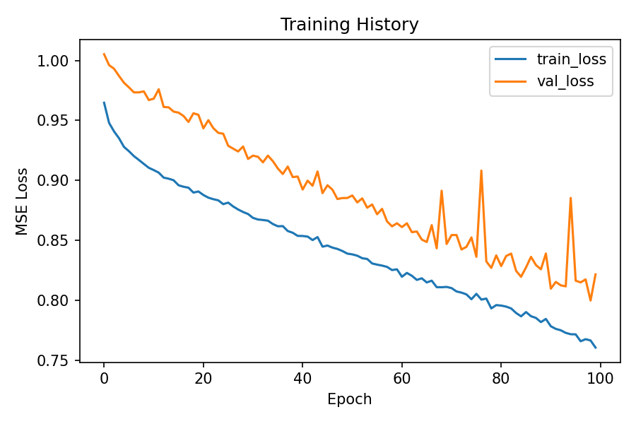

# 🌍 Earthquake Prediction with Machine Learning

## 📌 Problem Statement
Earthquakes are natural disasters that can have devastating effects.  
Some regions are more prone to frequent earthquakes than others, and predicting their **magnitude and depth** can help in disaster preparedness.  

This project builds a **Machine Learning model** to predict earthquake **magnitude and depth** based on past earthquake data (date, time, latitude, longitude, depth, etc.), and visualizes the results on an **interactive world map**.

---

## 🛠️ Tech Stack
- **Python 3.12**
- **TensorFlow / Keras**
- **Scikit-learn**
- **Pandas, NumPy**
- **Matplotlib, Seaborn**
- **Folium (Interactive Map Visualization)**

---

## 📂 Project Structure

    earthquake-prediction-ml/
    │── data/
    │ ├── database.csv # Raw dataset
    │ ├── processed.csv # Preprocessed dataset
    │ ├── train.csv # Training split
    │ ├── test.csv # Testing split
    │
    │── models/
    │ ├── earth_model.h5 # Trained ML model
    │
    │── notebooks/
    │ ├── exploration.ipynb # Jupyter for EDA & experiments
    │
    │── src/
    │ ├── preprocess.py # Data cleaning & preprocessing
    │ ├── split_data.py # Train/test split
    │ ├── train_model.py # Training pipeline
    │ ├── evaluate_model.py # Model evaluation
    │ ├── visualize.py # Generate interactive map
    │
    │── assets/
    │ ├── screenshots/ # Visualization screenshots
    │ ├── earthquake_map.html # Interactive map output
    │
    │── requirements.txt
    │── README.md


---

## 🔄 Data Pipeline
1. **Preprocessing**  
   - Convert Date & Time → Unix timestamp  
   - Select relevant features: Latitude, Longitude, Depth, Magnitude, Timestamp  
   - Handle invalid entries  

   ```bash

   python src/preprocess.py --input data/database.csv --output data/processed.csv

2. **Data Splitting**

    ```bash

    python src/split_data.py --input data/processed.csv --train data/train.csv --test data/test.csv

3. **Model Training**

    ```bash

    python src/train_model.py --input data/processed.csv --model models/earth_model.h5 --epochs 100 --batch_size 64

4. **Model Evaluation**

    ```bash

    python src/evaluate_model.py --input data/processed.csv --model models/earth_model.h5

5. **Visualization**

    ```bash

    python src/visualize.py --input data/test.csv --model models/earth_model.h5 --output assets/earthquake_map.html

---

## 🧠 Model Details
    - Neural Network (Fully Connected, Sequential API)
    -Layers:
        -Dense(64, ReLU)
        -Dense(32, ReLU)
        -Dense(2, Linear) → Outputs [Magnitude, Depth]
    -Optimizer: Adam
    -Loss: Mean Squared Error (MSE)
    -Metrics: Mean Absolute Error (MAE), RMSE

---

## 📊 Evaluation Metrics
After training and testing:

| Metric           | Value (Example) |
| ---------------- | --------------- |
| RMSE (Magnitude) | \~0.35          |
| RMSE (Depth)     | \~4.2           |
| MAE (Magnitude)  | \~0.28          |
| MAE (Depth)      | \~3.5           |


---

## 🗺️ Interactive Map

The predictions are visualized using Folium on a world map.
Each point represents an earthquake event, color-coded by predicted magnitude.

👉 Click here to view earthquake_map.html

  -**Example Screenshot:-**
  

  -**training loss**
  
---

## 📬 Contact

-**Email**: palakshkumar866@gmail.com

-**GitHub**: [Palaksh-singh](https://github.com/Palaksh-singh)

-**LinkedIn**: [Palaksh Kumar](https://www.linkedin.com/in/palaksh-kumar-584674346/)

-**Instagram**: [palakshkumar_](https://www.instagram.com/palakshkumar_)


